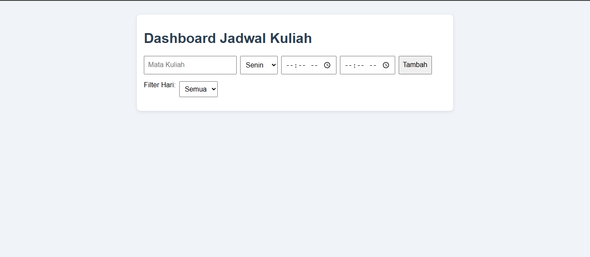
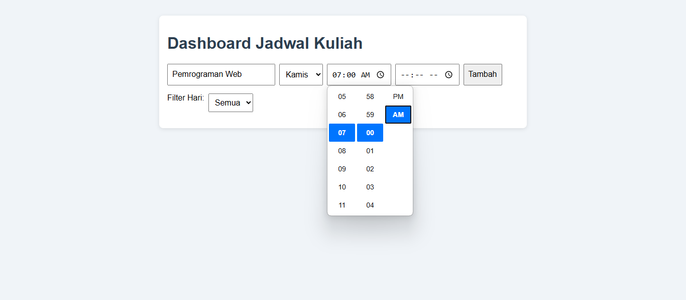
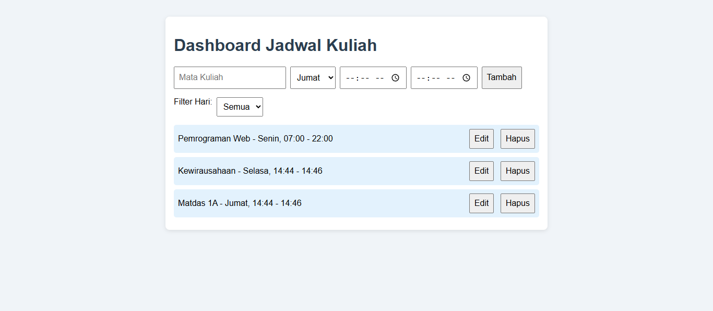

# 📘 Personal Dashboard Jadwal Kuliah

## 🧩 Deskripsi Singkat
Aplikasi ini adalah dashboard sederhana untuk mengelola jadwal kuliah pribadi. Pengguna dapat menambahkan, mengedit, dan menghapus jadwal mata kuliah, lengkap dengan hari serta jam masuk dan keluar. Semua data disimpan secara lokal di browser menggunakan `localStorage`, sehingga tidak hilang saat halaman direfresh.

## ⚙️ Fitur Aplikasi
- Tambah jadwal kuliah dengan mata kuliah, hari, jam masuk, dan jam keluar
- Edit dan hapus data jadwal
- Filter jadwal berdasarkan hari
- Data tersimpan di `localStorage` (penyimpanan lokal browser)

## 📸 Screenshot Aplikasi

> Ganti URL placeholder di atas dengan link gambar asli jika tersedia

## 🧪 Fitur ES6+ yang Diimplementasikan
- `let` dan `const` digunakan secara konsisten untuk deklarasi variabel
- **Arrow Function**:
  - Untuk event listener
  - Untuk rendering dan filter
  - Untuk operasi asinkron simulatif
- **Template Literals** digunakan untuk menampilkan konten HTML secara dinamis
- **Async/Await** diterapkan saat edit jadwal dengan simulasi delay async
- **Class** digunakan untuk membuat blueprint data `Schedule`

## 🗂️ Struktur Direktori
aplikasi/ 
├── index.html 
├── css/ 
│ └── style.css 
├── js/ 
│ └── main.js

## 🚀 Cara Menjalankan
1. Buka file `index.html` langsung di browser
2. Isi form dan tambahkan jadwal kuliah
3. Data akan otomatis tersimpan di localStorage

## 📌 Catatan
Jangan gunakan `cdn.tailwindcss.com` di produksi. Untuk produksi, gunakan Tailwind CLI atau PostCSS build.

